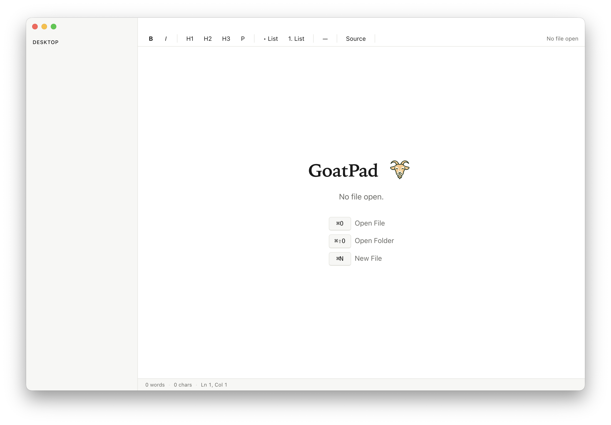

# GoatPad

A lightweight macOS markdown editor built for long-form writing projects done in collaboration with Claude.



## Why this exists

I spent about a month writing a book with Claude as a drafting partner. Half the project was the writing. The other half was fighting Word format round-trips, lost section breaks, and smart quotes turning into escape sequences. One bad section move cost me an entire afternoon of cleanup. And the .docx files were eating up my Claude usage on every pass.

GoatPad is the editor I wish I'd had on day one. Markdown in, markdown out, no surprises in between. It plays nicely with Claude's file workflow and stays out of your way.

## What it does

- Clean markdown editing with live preview
- Standard formatting controls (bold, italics, headers, lists, links)
- File-based, no cloud sync, no account required
- Round-trips cleanly to and from Claude without mangling your formatting
- Native macOS app, runs offline

## Install

Download the latest release: [GoatPad.zip](../../releases/latest)

Unzip and drag GoatPad.app to your Applications folder.

**First launch:** macOS Gatekeeper will warn that GoatPad is from an unidentified developer. This is normal for unsigned open-source apps. To open it the first time, right-click (or Control-click) the app and choose **Open** from the menu, then click Open in the dialog. After that, it launches normally.

Universal binary, runs on both Intel and Apple Silicon Macs.

## Build from source

Requires Node.js 18+.

```bash
git clone https://github.com/rlarro/goatpad.git
cd goatpad
npm install
npm run build
```

The built app lands in `dist/`.

## License

MIT. Use it, fork it, ship your own version.

Built with Claude Code in an afternoon. Refined over a couple of weeks of actual use.
